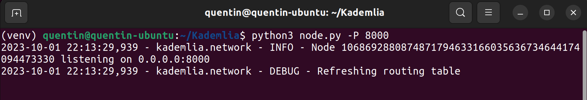
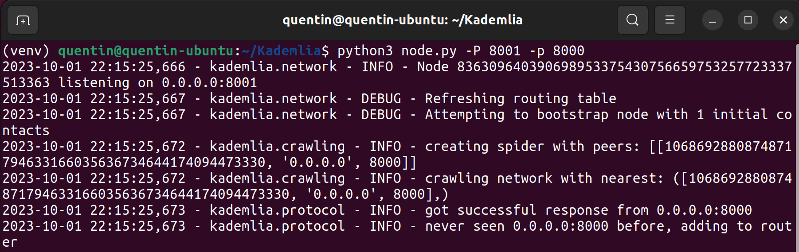
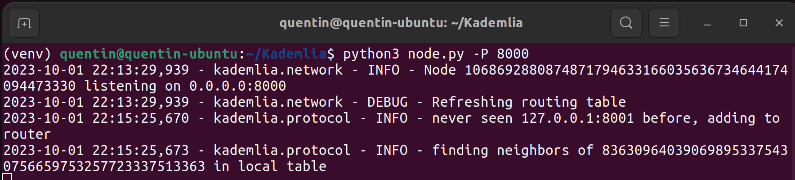
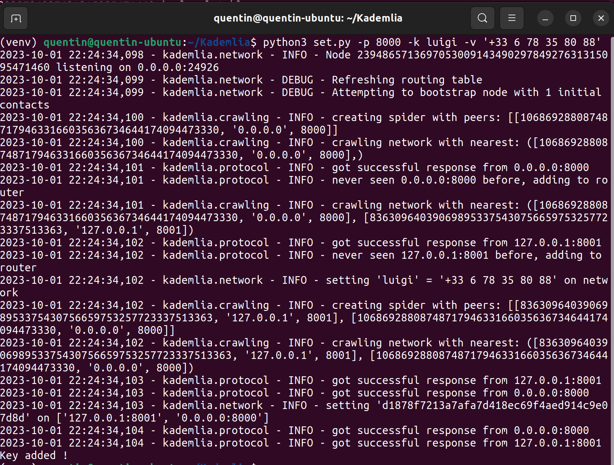
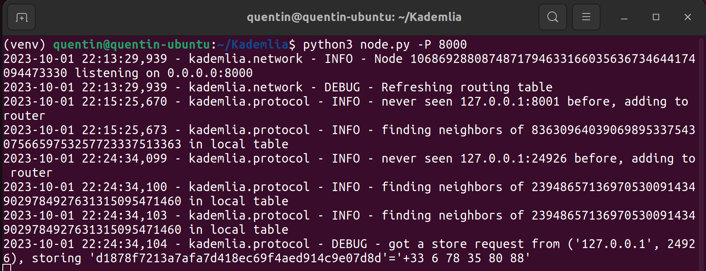
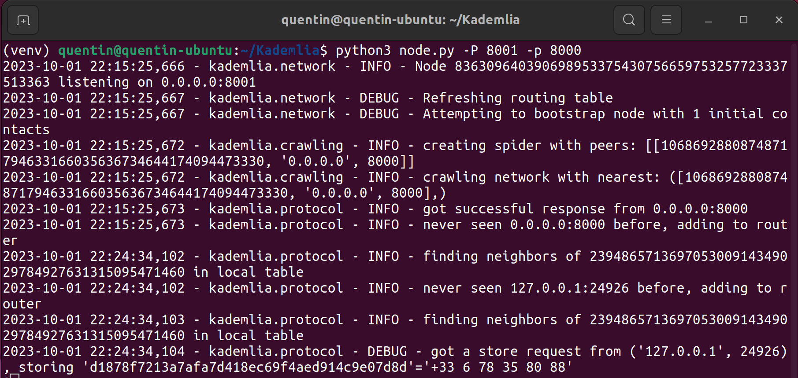
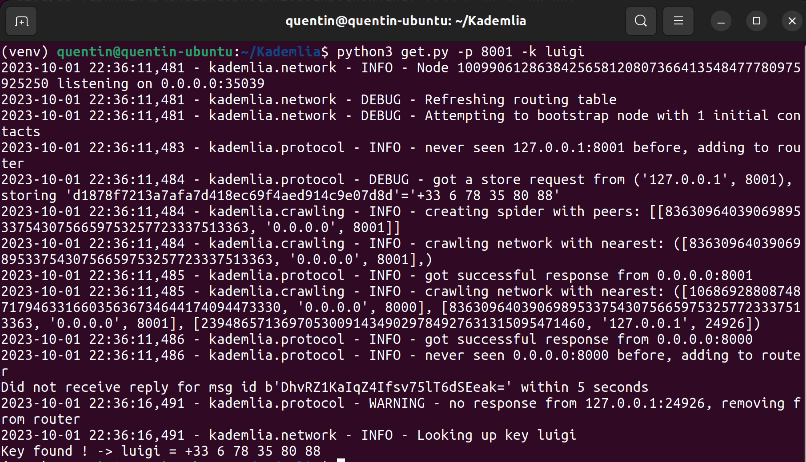
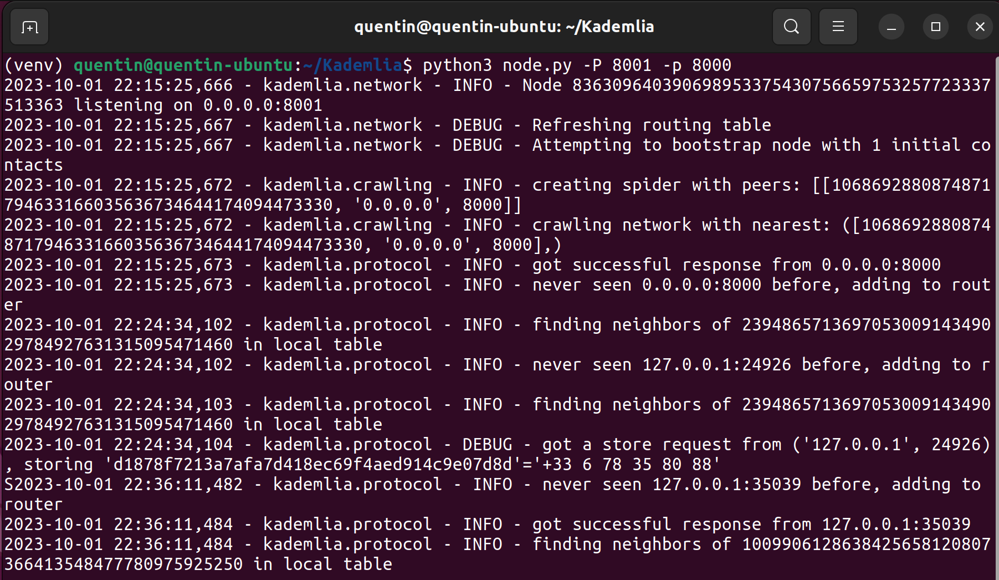
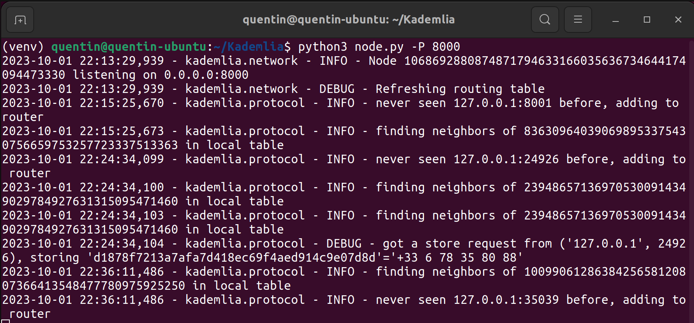

Références :

- [bmuller/kademlia: A DHT in Python using asyncio (github.com)](https://github.com/bmuller/kademlia)
- [Kademlia Documentation — Kademlia 2.2.1 documentation](https://kademlia.readthedocs.io/en/latest/)

# Introduction

Le projet GitHub, [bmuller/kademlia](https://github.com/bmuller/kademlia) est une bibliothèque Python contenant une implémentation asynchrone de la table de hachage distribuée Kadmelia. Elle utilise la bibliothèque asyncio de Python 3 pour fournir une communication asynchrone. Les nœuds communiquent en utilisant RPC sur UDP pour communiquer, ce qui signifie qu'elle est capable de fonctionner derrière un NAT.

# Installation

## Récupération du code

J'ai repris les [exemples des développeurs](https://github.com/bmuller/kademlia/tree/master/examples) et les ai un peu modifiés afin de pouvoir passer des paramètres supplémentaires. Ils sont trouvables sur mon GitHub : [QuentinDubois-Polytech/Kademlia (github.com)](https://github.com/QuentinDubois-Polytech/Kademlia)

```bash
git clone https://github.com/QuentinDubois-Polytech/Kademlia.git
```

## Installation de la bibliothèque

**Création d'un environnement virtuel Python :**

```bash
python3 -m venv venv
```

**Utilisation de l'environnement virtuel :**

Unix :

```bash
source venv/bin/activate
```

Windows :

```pwsh
# Besoin d'activer l'exécution des scripts si ce n'est pas activé par défault
Set-ExecutionPolicy Unrestricted -Scope Process

# Activation du venv
venv/Scripts/activate.ps1
```

**Installation de la bibliothèque Python :**  
La bibliothèque Python est disponible en tant que paquet Python sur PyPi sous le nom : kademlia ([kademlia · PyPI](https://pypi.org/project/kademlia/))

Nous allons donc utiliser le paquet Python pour l'installation.

```bash
pip3 install kademlia
```

## Scripts

Il existe 3 scripts :

- node.py
- get.py
- set.py

### Node.py

Ce script permet d'initialiser le premier noeud d'un réseau Kademlia ou d'ajouter un nouveau noeud à un réseau déjà existant

**Création d'un réseau :**

Créer un nouveau noeud sur le port UDP, \<port\>.

```bash
python3 node.py -P <port>
```

**Ajout d'un nouveau noeud :**

Créer un nouveau noeud sur le port UDP, \<port\>. \<joined_ip\> et\<joined_port\>sont respectivement l'adresse IP et le port d'un noeud présent sur le réseau.

```bash
python3 node.py -P <port> -i <joined_ip> -p <joined_port>
```

### Get.py

Ce script permet de récupérer la valeur associée à la clé \<key\> dans le réseau.

```bash
python3 get.py -i <joined_ip> -p <joined_port> -k <key>
```

Pour récupérer une valeur, le script crée un nouveau noeud dans le réseau, effectue l'opération "get", puis se déconnecte du réseau.

### Set.py

Ce script permet d'ajouter un nouveau tuple (\<key\>, \<value\>) dans le réseau.

```bash
python3 set.py -i <joined_ip> -p <joined_port> -k <key> -v <value>
```

Pour ajouter une valeur, le script crée un nouveau noeud dans le réseau, effectue l'opération "set", puis se déconnecte du réseau.

# Expérimentations

Pour les expérimentations, j'ai testé sous cet environnement :

- Ubuntu 22.04
- Python 3.10.6
- Paquet Python "kademlia" 2.2.2

## Création du premier noeud

Nous allons créer notre premier noeud sur le port 8000.

```bash
python3 node.py -P 8000
```

  

## Ajout d'un nouveau noeud

Nous allons ajouter un noeud sur le port 8001 avec pour noeud d'entrée celui sur le port 8000.

```bash
python3 node.py -P 8001 -p 8000
```

Dans cet exemple, je ne spécifie pas l'adresse IP du noeud que mon noeud veut rejoindre, car il se trouve sur l'interface réseau, local (0.0.0.0), qui correspond à la valeur par défaut, pour le champ IP



Nous remarquons que le noeud déjà existant, celui qui a permis au nouveau noeud d'entrer dans le réseau, vient d'ajouter ce nouveau noeud dans sa table de routage.



## Ajout d'une donnée

Nous allons maintenant ajouter une nouvelle donnée, le tuple : $(key, value) = (luigi, +33\space6\space78\space35\space80\space88)$. Vu l'implémentation actuelle, un nouveau noeud va être créé, il a donc besoin de connaitre un noeud pour rentrer dans le réseau comme pour le script [node.py](#Node.py)

```bash
python3 set.py -P 8000 -k luigi -v '+33 6 78 35 80 88'
```







On remarque les deux noeuds du réseau sur les ports 8000 et 8001, ont découvert un nouveau noeud sur le réseau au port 24926, suite à la demande de ce noeud, pour stocker une donnée. Ils ont ensuite reçu tous les deux une requête pour stocker une donnée. Dans Kademlia, contrairement à Chord, la donnée est répliquée sur un certain nombre de noeud. Dans notre exemple, elle est stockée sur les deux noeuds.

## Récupération de la donnée

Nous allons désormais récupérer la valeur stockée sous la clé : $key = luigi$  
Nous allons récupérer cette valeur en contactant le noeud sur le port 8001.

```bash
python3 get.py -P 8001 -k luigi
```



  



Nous arrivons bien à récupérer la valeur stockée sous la clé $luigi$ qui est $+33\space6\space78\space35\space80\space88$. Nous remarquons également que la demande GET n'est arrivée que sur le noeud au port 8001 et que celui-ci a répondu directement. Ce phénomène est normal puisque que ce noeud possède la donnée demandée. Finalement, le nouveau noeud a été ajouté aux tables de routages respectives, des noeuds sur les ports 8000 et 8001.

# Points d'amélioration

- Remplacer les scripts "get.py" et "set.py" par un client Python qui puisse se connecter à un noeud s'exécutant en local afin de lui spécifier interactivement les actions à effectuer. La communication s'effectuerait par un mécanisme d'IPC (Inter Communication Process).
- Ajouter une commande pour lister la table des clés et valeurs d'un noeud
- Ajouter une commande pour afficher les tables de routages (k-buckets) d'un noeud

Si une personne est motivée et désire continuer ce travail, ce serait avec plaisir.
